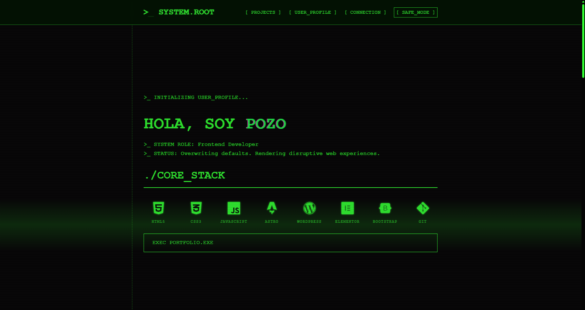
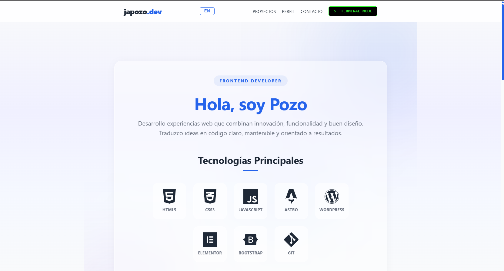

# JAPOZO.DEV | Portfolio System

> *"Rooted in Hardware. Compiled for Frontend."*


**[Ver en produccion](https://japozo.dev)**

---

## Preview

| Terminal Mode | Safe Mode |
|:---:|:---:|
|  |  |


---

## Concepto: Dual Mode

El portfolio se divide en dos interfaces visuales opuestas servidas bajo el mismo nucleo Astro:

### Terminal Mode (Root)

La experiencia por defecto. Una inmersion en la estetica hacker de los 90s.

- Efectos **CRT / Scanlines** en CSS puro.
- Animacion de escritura en tiempo real.
- Navegacion por comandos simulados.
- Paleta monocromo fosforo verde (`#33ff33`).

### Safe Mode (Visual UI)

Interfaz grafica moderna pensada para facilitar la legibilidad y experiencia de usuario.

- **Glassmorphism**: hero con blobs flotantes animados y contenedor glass con `backdrop-filter`.
- **Tech Grid** con hover por colores de marca (HTML rojo, CSS azul, JS amarillo...).
- **Tarjetas de proyecto** con thumbnails y layout horizontal.
- **Skill Tags** agrupados por categoria con animacion de entrada escalonada y efecto glow en cadena al pasar el raton.
- **Selector de idioma ES / EN** con persistencia en `localStorage`.
- Diseno responsive con menu movil adaptado.

---

## Stack y Arquitectura

| Tecnologia | Implementacion |
|------------|----------------|
| **[Astro](https://astro.build/)** | Core Framework — SSG (Static Site Generation) |
| **CSS Puro** | Glassmorphism, custom properties, keyframe animations, responsive design |
| **JS Vanilla** | IntersectionObserver para scroll reveals, i18n client-side, logica de modos |
| **SEO** | `sitemap.xml` automatico, `robots.txt`, OG tags, Twitter cards, canonical URLs |
| **i18n (ES/EN)** | Traducciones centralizadas en `i18n.js`, atributos `data-i18n`, persistencia `localStorage` |
| **Anti-spam** | Email en Base64 + gate click-to-reveal: nunca aparece en el DOM hasta que un humano hace click |
| **Config Global** | `src/config.js` como Single Source of Truth para datos del sitio y redes sociales |
| **Componentes** | Tarjetas de proyecto por modo (`TerminalCard`, `VisualCard`), iconos SVG dinamicos con props |
| **Layout Base** | `BaseLayout.astro` — gestion centralizada de SEO, `<head>`, favicon y scripts |

---

## Estructura del Proyecto

```text
/
├── public/
│   ├── Assets/
│   │   ├── css/
│   │   │   ├── styles.css          # Estilos Terminal Mode
│   │   │   └── safeMode.css        # Estilos Safe Mode (glassmorphism)
│   │   ├── js/
│   │   │   ├── script.js           # Logica Terminal Mode
│   │   │   ├── safeMode.js         # Logica Safe Mode
│   │   │   └── i18n.js             # Traducciones ES/EN
│   │   └── img/
│   │       ├── profile.jpg
│   │       └── projects/           # Thumbnails de proyectos
│   └── robots.txt
├── src/
│   ├── config.js                   # Configuracion global (SSOT)
│   ├── components/
│   │   ├── AsciiArt.astro          # Arte ASCII del hero terminal
│   │   ├── TerminalCard.astro      # Tarjeta proyecto — Terminal
│   │   ├── VisualCard.astro        # Tarjeta proyecto — Visual
│   │   └── icons/                  # 9 iconos SVG dinamicos
│   ├── layouts/
│   │   └── BaseLayout.astro        # Layout maestro (SEO, head, scripts)
│   └── pages/
│       ├── index.astro             # Terminal Mode
│       └── safeMode.astro          # Safe Mode
└── astro.config.mjs
```

---

## Autor

**J. A. Pozo** — Frontend Developer desde Gijon, Espana.

- [LinkedIn](https://www.linkedin.com/in/joseantoniopozogonzalez/)
- [japozo.dev](https://japozo.dev)
